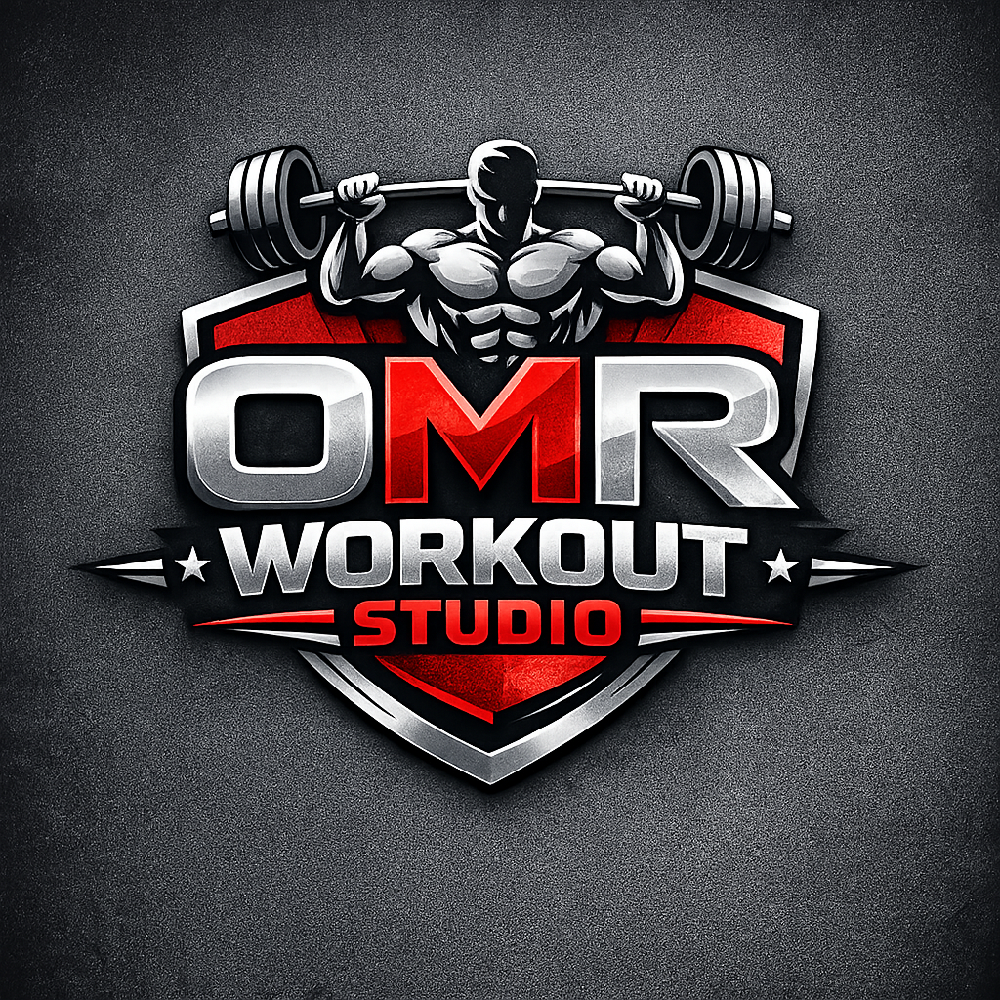
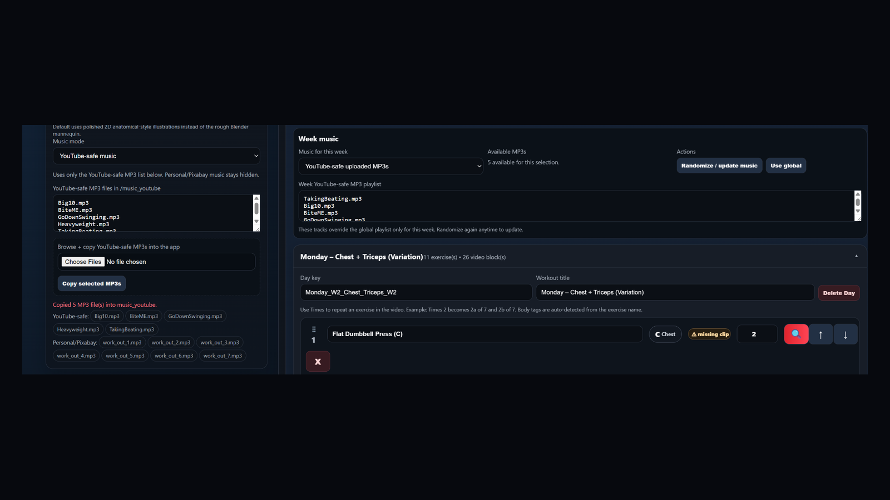
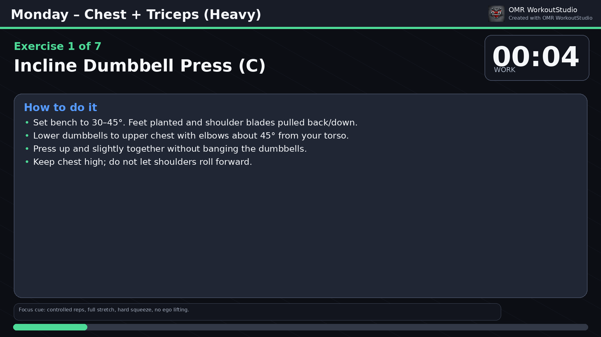

# OMR WorkoutStudio

<p align="center">
  
</p>

<p align="center">
  <strong>Create branded workout videos from weekly workout plans.</strong><br />
  Multi-week planning, clean exercise illustrations, custom instructions, YouTube-safe music, and desktop video generation.
</p>

<p align="center">
  <a href="https://omr226.github.io/OMR-WorkoutStudio/"><strong>🌐 Live Download Page</strong></a>
  ·
  <a href="https://github.com/OMR226/OMR-WorkoutStudio/releases/latest"><strong>⬇️ Latest Release</strong></a>
  ·
  <a href="https://www.youtube.com/@OMRWorkoutStudio"><strong>▶️ YouTube</strong></a>
  ·
  <a href="https://omarr-backend-lab.netlify.app/"><strong>💻 Developer Blog</strong></a>
</p>

---

## About

**OMR WorkoutStudio** is a Windows desktop-style workout video generator. It lets you build weekly workout plans, add exercises, generate instruction screens, add music, and export branded workout videos.

This repository is the **public showcase and download page** for the app.

> **Important:** The private application source code is not stored in this public repository. This repo is intentionally limited to the marketing website, screenshots, release instructions, and public-facing documentation.

---

## Screenshots

### App UI



### Clean illustration mode



### Generated video layout


---

## Key features

### Multi-week workout planner

- Create Week 1, Week 2, Week 3, and beyond.
- Each week can have its own workout days.
- Each day can have its own exercise combination.
- Weeks and days are collapsible so the page stays manageable.
- Generate all weeks, one week, or one specific day.

### Exercise builder

- Add exercises from the built-in library.
- Search exercises through the app/API workflow.
- Add custom exercises with AI-assisted instruction prompts.
- Save custom/API-added exercises for future dropdown selection.
- Exercise dropdown is sorted by body type and exercise name.
- Drag and drop exercise rows.
- Set repeat counts per exercise, such as `Incline Press x2`.

### Clean illustration video mode

The default visual style uses clean anatomical-style illustrations instead of rough 3D mannequin output.

Generated videos can show:

- target-muscle highlights
- movement arrows
- ghost start/end poses
- exercise instructions
- body focus badges
- progress/timer layout

### 30-second startup intro

Workout videos start with a 30-second intro:

- first 10 seconds: workout summary
- final 20 seconds: first upcoming exercise instructions

This keeps the first exercise consistent with the rest of the video.

### YouTube-safe music workflow

- Add MP3s directly through the app.
- Separate YouTube-safe music from Personal/Pixabay music.
- Use global music or week-specific music.
- Randomize/update week music.
- Playlist rotation uses all selected tracks instead of repeating only one track.

### Program templates

- Save workout programs.
- Load saved programs later.
- Reuse multi-week routines without rebuilding them from scratch.

### Optional Studio Animation Library

Advanced users can attach or generate animation clips for exercises.

This is optional. The app works without it because clean illustration mode is the default.

---

## How to download

Go to the latest release:

[Download the latest Windows build](https://github.com/OMR226/OMR-WorkoutStudio/releases/latest)

Expected release asset name:

```text
OMR_WorkoutStudio_Windows.zip
```

---

## How to run the app

1. Download the latest ZIP from Releases.
2. Extract the ZIP.
3. Open the extracted folder.
4. Double-click:

```text
run_app.bat
```

The app opens in your browser as a local desktop-style app.

---

## Music folders

The app keeps music separated by intended use.

```text
music_youtube/
```

Use this for YouTube-safe MP3 files.

```text
music_pixabay/
```

Use this for Personal/Pixabay tracks.

The app also includes a browser upload/copy workflow so you do not have to manually copy MP3 files into folders every time.

---

## Public repository structure

```text
OMR-WorkoutStudio/
  docs/
    index.html
    styles.css
    script.js
    config.js
    assets/
  release-assets/
    PUT_BUILT_APP_ZIP_HERE.txt
  README.md
  GITHUB_SETUP.md
  RELEASE_CHECKLIST.md
```

---

## What this repo contains

This public repository contains:

- marketing/download website
- screenshots and public images
- release setup notes
- GitHub Pages setup notes
- public README documentation

---

## What this repo does not contain

This public repository should **not** contain:

- private Python source code
- private desktop build scripts
- full app source folders
- internal app data
- personal workout files
- unlicensed music files
- generated user videos

The app source should stay in a private repository or local build folder.

---

## GitHub Pages setup

This repo is designed to publish from the `docs/` folder.

Suggested GitHub Pages settings:

```text
Source: Deploy from branch
Branch: main
Folder: /docs
```

After publishing, the public website should be available at:

```text
https://omr226.github.io/OMR-WorkoutStudio/
```

---

## Release setup

When publishing a new desktop version:

1. Build the private desktop app.
2. Zip the app as:

```text
OMR_WorkoutStudio_Windows.zip
```

3. Create a new GitHub Release.
4. Upload the ZIP as a release asset.
5. Update `docs/config.js` when the version changes.
6. Update this README with the new version notes.

---

## FAQ

### Is this open source?

No. This is a public showcase and download repository. The app source code is private.

### Can users download the app from this repo?

Yes, through the GitHub Releases download link.

### Can users see the source code?

Not from this repo, as long as only the marketing website and release documentation are committed here.

### Does the app need to be hosted publicly?

No. The app runs locally like a desktop app. The public website is only for showcasing and downloading it.

### Does the app require Blender?

No for normal use. Clean illustration mode is the default. Blender is only for advanced/experimental 3D animation workflows.

### Does the app require external animation videos?

No. The app can generate videos with clean illustration mode without external animation clips.

### Can I use YouTube-safe music?

Yes. Put YouTube-safe MP3 files in the YouTube-safe music workflow and choose YouTube-safe mode in the app.

### Why keep YouTube-safe and Personal/Pixabay music separate?

Because licensing and upload behavior can differ by platform. Keeping music separated reduces accidental misuse.

### Can I generate only one day instead of the full week?

Yes. The app supports rendering all weeks, one week, or one specific day.

### Can I reuse custom exercises later?

Yes. Custom and API-added exercises are saved for future selection.

---

## Developer

Built by **Omarr Syed**.

- GitHub: [OMR226](https://github.com/OMR226)
- Developer Blog: [Omarr's Backend Lab](https://omarr-backend-lab.netlify.app/)
- YouTube: [OMR WorkoutStudio](https://www.youtube.com/@OMRWorkoutStudio)
- Support: [Buy Me a Coffee](https://www.buymeacoffee.com/omr226)

---

## License / usage note

This repository is provided as a public showcase and download page for OMR WorkoutStudio. The application itself is distributed through release builds. Do not copy private source code, private assets, personal media, or unlicensed third-party content into this public repository.
