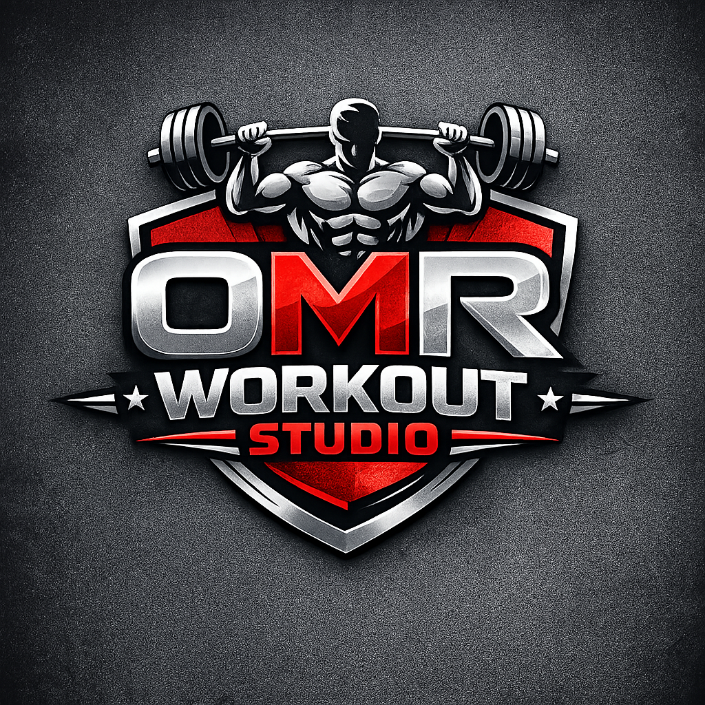
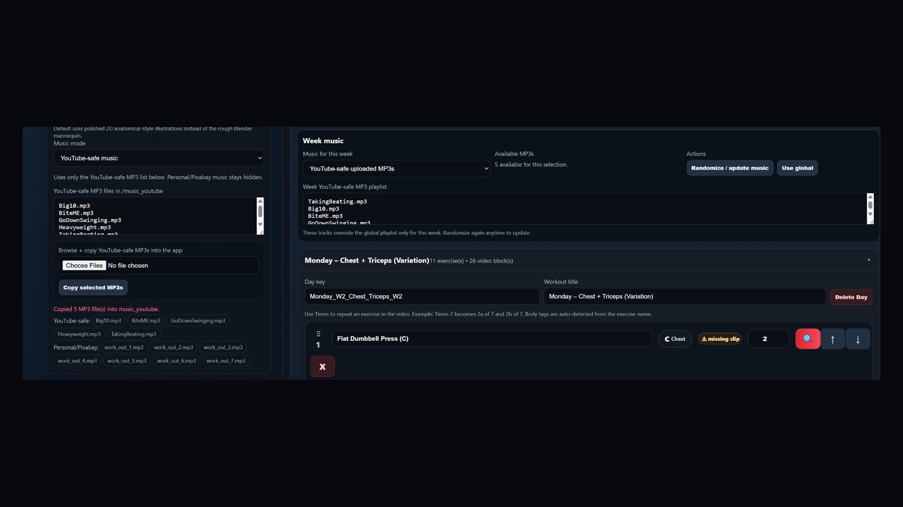
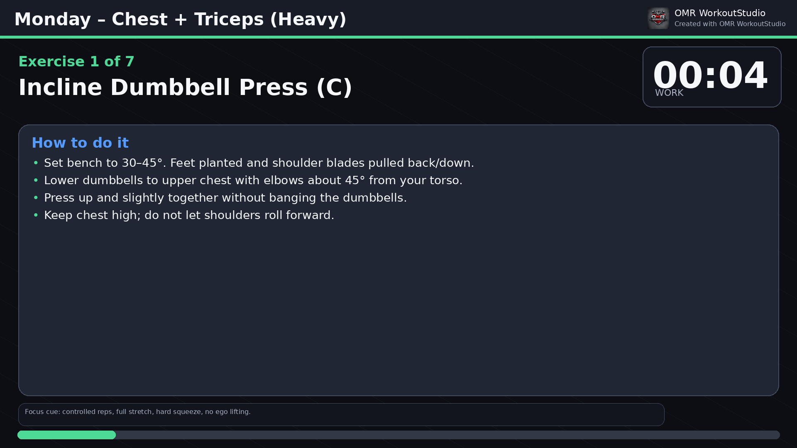

# OMR WorkoutStudio

<p align="center">
  
</p>

<p align="center">
  <strong>Two editions. One workout platform.</strong><br />
  OMR WorkoutStudio Lite focuses on workout-video creation. OMR WorkoutStudio Pro adds Live Workout, progression tracking, mobile training, camera rep capture and workout recording.
</p>

<p align="center">
  <a href="https://omr226.github.io/OMR-WorkoutStudio/"><strong>🌐 Product & Download Page</strong></a>
  ·
  <a href="https://github.com/OMR226/OMR-WorkoutStudio/releases"><strong>⬇️ Releases</strong></a>
  ·
  <a href="https://www.youtube.com/@OMRWorkoutStudio"><strong>▶️ YouTube</strong></a>
  ·
  <a href="https://omarr-backend-lab.netlify.app/"><strong>💻 Developer Blog</strong></a>
</p>

---

## Editions

### OMR WorkoutStudio Lite 1.0

The streamlined **video-only** edition. It is based on the final pre-Live-Workout video-generation line and is intended for users who primarily want to build branded follow-along workout videos.

Includes:

- multi-week workout planning
- categorized exercise selection and instructions
- 2-image / loop / instructions-only visual modes
- per-exercise video repeats
- timers, progress bars, music and branded workout output
- 1080p MP4 generation and export presets

Release tag: `lite-v1.0`

Expected asset:

```text
OMR_WorkoutStudio_Lite_1.0_Windows.zip
```

### OMR WorkoutStudio Pro 2.0

The complete edition. **Pro includes the Lite video-generation workflow** and adds the interactive workout/training system.

Additional Pro capabilities include:

- Live Workout with Standard Sets and Timed Circuit
- target reps, actual reps, working weight and RIR tracking
- exercise-specific rest/timing recommendations
- progressive-overload history and suggestions
- secure mobile/PWA Live Workout companion
- camera-based rep counting with rear/selfie camera switching
- live workout recording, playback and history
- archive, ZIP and bulk recording management
- unilateral Left / Right exercise support

Release tag: `pro-v2.0`

Expected asset:

```text
OMR_WorkoutStudio_Pro_2.0_Windows.zip
```

---

## Screenshots

### Pro 2.0

See the current Pro interface on the GitHub Pages product page.

### Lite 1.0



### Generated video output



---

## How to download

Use the GitHub Pages product page:

https://omr226.github.io/OMR-WorkoutStudio/

Or go directly to GitHub Releases:

https://github.com/OMR226/OMR-WorkoutStudio/releases

The marketing page provides separate Download buttons for **Lite 1.0** and **Pro 2.0**.

---

## How to run

1. Download the ZIP for the edition you want.
2. Extract the ZIP.
3. Open the extracted folder.
4. Run:

```text
run_app.bat
```

The application opens in your browser as a local desktop-style application.

---

## Public repository purpose

This repository is the **public showcase, documentation and download repository** for OMR WorkoutStudio.

The private application source code is intentionally **not** stored here.

### This repository contains

- GitHub Pages marketing/download website
- public screenshots and branding assets
- public release documentation
- release setup/checklists

### This repository should not contain

- private Python source code
- internal build scripts
- personal workout data
- generated user recordings/videos
- unlicensed music files
- private application secrets or API keys

---

## Repository structure

```text
OMR-WorkoutStudio/
  docs/
    index.html
    styles.css
    script.js
    config.js
    assets/
  release-assets/
    PUT_BUILT_APP_ZIP_HERE.txt
  README.md
  GITHUB_SETUP.md
  RELEASE_CHECKLIST.md
```

GitHub Pages publishes from `main` → `/docs`.

---

## Release setup

Create **two separate GitHub Releases** so each edition has a permanent download URL.

### Lite 1.0

```text
Tag: lite-v1.0
Release name: OMR WorkoutStudio Lite 1.0
Asset: OMR_WorkoutStudio_Lite_1.0_Windows.zip
```

### Pro 2.0

```text
Tag: pro-v2.0
Release name: OMR WorkoutStudio Pro 2.0
Asset: OMR_WorkoutStudio_Pro_2.0_Windows.zip
```

The download URLs are configured in `docs/config.js`.

---

## Licensing / music note

Users remain responsible for ensuring that music and other imported third-party content is properly licensed for the way they publish or distribute generated videos. Do not commit unlicensed audio into this public repository.

---

## Developer

Built by **Omarr Syed**.

- GitHub: https://github.com/OMR226
- Developer Blog: https://omarr-backend-lab.netlify.app/
- YouTube: https://www.youtube.com/@OMRWorkoutStudio
- Support: https://www.buymeacoffee.com/oms210
